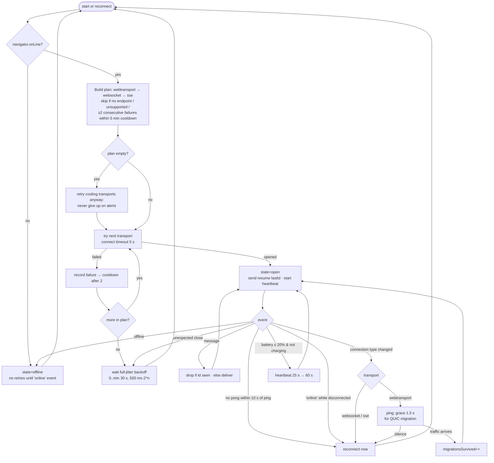

# ADR-003: WebTransport vs WebSocket Protocol Selection for Disaster Network Conditions

- **Status:** Proposed
- **Date:** 2026-09-23
- **Spike:** #603 (time box 4 days)
- **Evidence:** [Spike #603 benchmark report](../spikes/603-transport-benchmark-report.md)
- **Prototype:**
  - `src/services/networkTransport.js` (21 tests in `test/network-transport.test.js`)
  - `scripts/spikes/quic_stress_test.js`
  - `scripts/spikes/webtransport_server/`: quinn WebTransport server and client (Rust, `wtransport`)

## Context

Emergency alerts reach browsers today over Server-Sent Events (`/events/stream`, see `src/lib/contract.ts`). That is TCP, like WebSocket. When cell towers are overloaded, loss rises and TCP's in-order delivery lets one lost segment stall every alert queued behind it (head-of-line blocking). The question: would WebTransport over HTTP/3 (QUIC) deliver alerts faster and more reliably at 200 ms RTT with 10–30% loss? A second question is what it costs in reconnection behavior and battery.

## What the evidence says

The full tables are in the [benchmark report](../spikes/603-transport-benchmark-report.md). In summary:

1. **Head-of-line blocking matters only in a narrow band.** On a real QUIC stack (quinn, live through a lossy UDP proxy), one alert per stream against one ordered stream:
   - **Normal load (2 alerts/s), 20% loss:** p95 halved (801 vs 1,660 ms) and no deadlines were missed (vs 3.3%).
   - **Surge load (20 alerts/s):** no gain.
   - **30% loss, either load:** worse (35.8% vs 17.5% missed at 2/s).

   The simulation predicted a uniform 5–15% p95 gain; reality is more conditional.

2. **QUIC's advantage over TCP is in loss recovery.** In the model, QUIC's probe timeout avoids TCP's retransmission-timeout collapse, which cuts deadline misses at 20% loss from 21% to about 4% (10 alerts/s). This comparison is **model-only**. The real TCP arm needs `tc netem` (root) and has not been run.
3. **Surge traffic above about 10% loss is capacity-bound whatever the transport.** At 20 alerts/s, real QUIC missed the 2 s deadline for about 60% of alerts at 20% loss and about 91% at 30%. Loss-based congestion control throttles below the offered load, and no transport change fixes that. The only lever is sending less.
4. **Reconnection is dominated by detection, not the handshake.**
   - Reacting to `online` or `navigator.connection` `change` saves about 22 s at p50 over waiting for a heartbeat timeout.
   - A fresh WebTransport session saves 1 RTT (about 200 ms) over WebSocket, which disappears into timer jitter under loss.
   - Only **QUIC connection migration** is a step change (about 10× faster at p50 under loss). Browser support for migrating WebTransport sessions is **unverified**.
5. **Battery was not measured** (see below).

## Decision

1. **Adopt `networkTransport.js` as the single alert transport client.** Its reconnection logic delivers most of the measurable benefit on _any_ protocol:
   - immediate reconnect on network-change events
   - heartbeat liveness checks with a pong timeout
   - full-jitter backoff
   - resume from the last ID with de-duplication
2. **Keep WebSocket as the production primary. Ship SSE as the always-available fallback**; it already exists server-side.
3. **Treat WebTransport as an opportunistic upgrade, not a dependency.** The client tries it first when an HTTP/3 endpoint is configured and the browser supports it, and cools it down after repeated failures (for example UDP/443 blocked).
   - We will not stand up the HTTP/3 endpoint until follow-ups 1 and 2 show a real TCP-vs-QUIC gap.
   - It also needs a host that accepts inbound UDP. We believe Render's proxy is TCP-only, but that is unconfirmed; confirm with Render before planning.
4. **Use one stream per alert on WebTransport.** It is the only configuration that measurably beat head-of-line blocking (normal load, 20% loss). It also keeps a large alert from delaying a small urgent one. Its penalty at 30% loss comes when delivery is failing anyway; revisit it if that penalty holds on real networks at lower loss.
5. **Server-side load shedding is the highest-value follow-up** for surge conditions (finding 3). Coalesce superseded updates, for example only the latest `LocUpd` per request, and prioritize `RqCreated` over location churn.

## Reconnection and fallback decision tree

Implemented by `selectTransports()` and `createNetworkTransport()`. Every branch is covered by `test/network-transport.test.js`.

## Battery impact

**Not measured.** No physical devices were available in the time box, and desktop Chrome has no meaningful battery signal. What we can say:

- **Radio wake-ups dominate energy on cellular.** Each heartbeat that is not piggybacked on real traffic keeps an LTE radio in its high-power state for the carrier's inactivity tail, typically several seconds. The transport's 25 s heartbeat means up to 144 wake-ups per hour. On low battery it stretches to 60 s: 60 per hour, about 58% fewer. `getMetrics().heartbeatsSent` exposes the actual count for field telemetry.
- **QUIC may cost more to keep idle, not less.** Carrier NATs commonly expire UDP mappings sooner than TCP ones, so a push-capable QUIC session may need _more_ frequent keepalives than WebSocket. That would be a battery regression for WebTransport. It is a known deployment concern for QUIC (RFC 9308, applicability of QUIC), not a spike measurement.
- **Retransmissions scale with the loss rate, not the protocol.** Retransmit overhead measured about equal to the loss rate for both TCP and QUIC (report §2), so under loss the extra airtime is a wash.

**Measurement protocol for follow-up 2**: the same Android phone on the same carrier, 60 minutes idle with alerts at 1 per minute, for each of WebSocket, WebTransport and SSE. Measure with `adb shell dumpsys batterystats --reset` / `dumpsys batterystats` (per-UID mobile radio active time) and Chrome `chrome://net-export` for keepalive cadence. Repeat on iOS Safari using the Xcode Energy Log (WebSocket and SSE only unless WebTransport is available).

## Consequences

- `networkTransport.js` is ready to replace the bare `EventSource` in `subscribeToContractEvents` (`src/lib/contract.ts`) using only the SSE endpoint today. That swap is left to a follow-up PR so this spike does not change production behavior.
- A future WebSocket or WebTransport server must implement the small wire protocol in the `networkTransport.js` header: alert `id`, `resume`/`lastId`, and `ping`/`pong`.
- The Rust spike crate is a test harness only. A production HTTP/3 endpoint would need real certificates, auth and a UDP-capable host.

## Follow-ups

1. Run `sudo node scripts/spikes/quic_stress_test.js netem` to measure real TCP against the same QUIC arms. This confirms or refutes finding 2.
2. Run the device battery protocol above.
3. Collect field telemetry from `getMetrics()`: `reconnectGapsMs`, `fallbacks`, `failures.webtransport` (how often UDP is blocked) and `migrationsSurvived` (whether browsers migrate).
4. Build server-side alert coalescing and prioritization for surge load.
